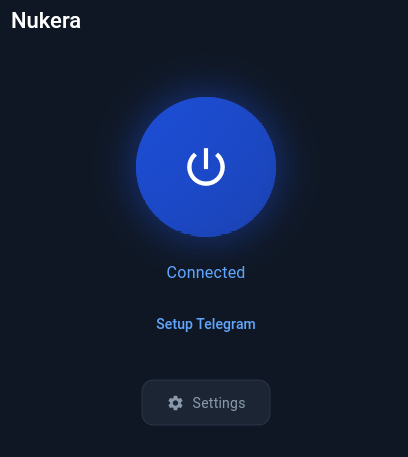

# Nukera

[Русский](README.md) · [English](README.en.md)

<div align="center">

# 💾 DOWNLOAD — СКАЧАТЬ


[**Windows**](https://github.com/finestcrtn/nukera/releases/download/v0.1.0/Nukera.exe) · [**Android**](https://github.com/finestcrtn/nukera/releases/download/v0.1.0/Nukera-arm64-v8a.apk) · [**Linux**](https://github.com/finestcrtn/nukera/releases/download/v0.1.0/Nukera-Linux-x86_64.AppImage)

</div>

## What it is



Nukera is a GUI app based on Zapret’s principles and other ways of bypass, designed to unblock **Instagram, Telegram, YouTube, Discord**, and all other blocked websites — even those that other Zapret alternatives cannot unblock. Best of all, it requires no manual configuration: Just turn it on, and it works.

## Why Nukera

- **Just turn it on.** Everything works right away — like a VPN, but free and private. No terminal, no config files, no manual proxy setup.
- **Telegram proxy built in.** The Telegram app connects through it automatically — nothing to configure.
- **Works where other tools give up.** Instagram Reels, WhatsApp and Telegram — right away, no fiddling with settings.
- **Free, local, private.** Everything runs on your machine; no data is sent anywhere.
- **Open source.** Rust core + Flutter GUI.

## Install — 30 seconds

- **Windows:** download **`Nukera.exe`** and run it.
- **Android:** install **`Nukera-arm64-v8a.apk`** (allow installing from unknown sources).
- **Linux:** run **`Nukera-Linux-x86_64.AppImage`** by double-click and accept **one** password prompt on first launch — after that it works without prompts.

## How to use

- **All sites are unblocked by default** — nothing extra to set up.
- **Telegram in a browser just works**, out of the box.
- **For the Telegram app:** tap the **“Set up Telegram”** button — Telegram opens and you just accept the proxy. Do this once, and it works while Nukera is on. Do it again if the proxy stops working.
- **If some sites don't work:** tap **“Optimize” («Адаптировать под ваш интернет»)**. A strategy test runs, and in a few minutes Nukera picks the best one for your network. Only do this if it really doesn't work.

**Android, page won't load:** refresh it 3–5 times — it will load and open instantly afterwards. Make sure the app is actually on; if needed, force-stop it and restart.

## Where it may not work

- Requires Linux with **systemd** and a recent glibc (≥ 2.39): Arch/Manjaro, Fedora ≥ 39 (incl. Silverblue), Ubuntu 24.04 LTS, Debian 13, openSUSE Tumbleweed.
- Older Ubuntu 22.04 / Debian 12 may not start — a warning is shown.
- Some ISPs still block some sites; no tool can guarantee every site on every network.
- No macOS build yet.

## From source (for developers)

```bash
# needs: cargo (rustup), Flutter stable, squashfs-tools
scripts/build-appimage.sh
```

## What's inside

Rust core + Flutter (GTK) GUI · `nfqws` (zapret) DPI desync with strategy pool · native Telegram WebSocket proxy · DoH resolver + curated hosts IP maps · systemd daemon with passwordless polkit.

## Help

`Nukera-Linux-x86_64.AppImage --verify` — check what your system supports before installing.